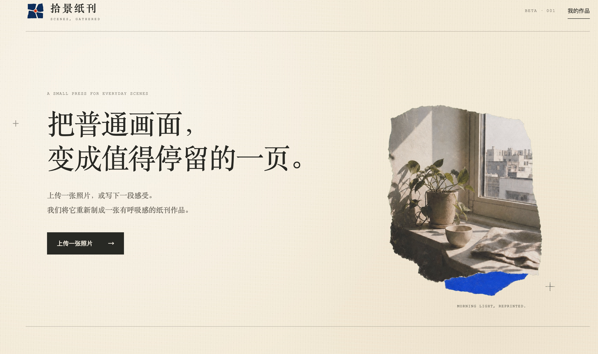

<div align="center">

# 作者自己开发的网站已上线：https://zeejayzine.com/ 。  欢迎使用（接入GPT5.6+image2顶流模型，国内环境可用）

# 拾景zine

### GATHERED SCENES ZINE

把普通画面，变成值得停留的一页。

**作者 / Author · Zeejay0**

[English](README.en.md) · [两种创作路径](#两种创作路径) · [开始使用](#开始使用) · [作品档案](#作品档案)

</div>



> A SMALL PRESS FOR EVERYDAY SCENES.

拾景纸刊是一组为 Codex 编写的生图 Skill。它不把照片当作等待套用的模板，而是先阅读场景：辨认主体、空间、色彩、动作与没有说完的情绪，再选择保留真实现场，或把现场蒸馏为一件新的纸上作品。

照片提供事实，创作决定如何留下它。

---

## 我们如何观看一张照片

```text
一张照片  →  阅读现场  →  提取关系  →  选择创作路径  →  重新装订成一页
```

我们优先保留场景中真正重要的关系，而不是复制所有细节：人物与远方、窗与光、道路与方向、植物与空白，以及一瞬间留下的情绪余韵。

这套视觉语言建立在五条原则上：

- **真景为锚**：真实场景不是装饰素材，而是作品的事实基础。
- **插画成场**：插画扩展照片尚未说完的空间，而不是描摹照片。
- **色彩成结构**：高纯度色彩负责平衡、方向和视觉重心。
- **纸面会呼吸**：留白参与叙事，复杂信息被压缩成少量清楚的形。
- **边界有触感**：撕纸、纤维、干墨与印刷误差构成材料语言。


## 两种创作路径

同一张照片，可以被保存，也可以被重新想象。本仓库收录两个互补的 Skill。

| | 实景拼贴 · Gathered Scenes | 影像蒸馏 · Scene Distillation |
| --- | --- | --- |
| **适合** | 想保留原照片与现场身份 | 想获得独立成立的原创插画作品 |
| **照片的角色** | 成为最终海报中的真实视觉锚点 | 只作为语义与情绪来源，不进入成品 |
| **转化方式** | 摄影、抽象插画、结构性色彩与手撕边界共同构图 | 从事实中提取命题、张力与视觉隐喻，重新创作 |
| **结果** | 真实而克制的纸感拼贴海报 | 表达优先的极简编辑插画 |
| **调用名称** | `$scenes-gathered-zine-v1-3` | `$scene-distillation-zine-v1-3` |

### 01 · 实景拼贴

`scenes-gathered-zine-v1-3` 保留照片中不可替代的现场关系，以真实摄影作为锚点，让源自原图的抽象形状、单一高纯度色彩与可见的手撕纤维边缘向纸面延伸。

它适合这样的请求：

```text
用 $scenes-gathered-zine-v1-3 把这张照片做成一张拾景纸刊海报。
保留人物与海岸线的关系，文字用中文。
```

[阅读完整 Skill](skills/scenes-gathered-zine-v1-3/SKILL.md)

### 02 · 影像蒸馏

`scene-distillation-zine-v1-3` 不在成品中保留原始照片。它从照片中提取语义核心、情绪张力和视觉隐喻，再用纸张、插画、色彩与自由文字创作一件新的作品。

它适合这样的请求：

```text
用 $scene-distillation-zine-v1-3 重新创作这张照片。
不要保留照片本身，让作品表达“靠近与错过”。
```

[阅读完整 Skill](skills/scene-distillation-zine-v1-3/SKILL.md)

## 从现场到纸面

每次创作都会经历同一套观察过程，但不会套用固定模板。

| 阶段 | 发生什么 |
| --- | --- |
| **01 · 观察** | 找到核心主体、空间关系、方向、重量与安静区域 |
| **02 · 取舍** | 保留让场景仍然成立的最少信息，移除无关细节 |
| **03 · 转译** | 将轮廓、路径、光影或情绪转为纸上形状与色彩结构 |
| **04 · 编排** | 让摄影、插画、文字、边界与留白形成清楚的观看路径 |
| **05 · 成页** | 输出一张平面、克制、有触感且能独立成立的纸刊作品 |

## 作品档案

这里将按“原始照片 → 观察记录 → 最终作品”保存代表案例，而不是只陈列一面结果图墙。每份档案会说明作品保留了什么、舍弃了什么，以及色彩和构图如何从现场生长出来。

### 实景拼贴 01 · 第比利斯远眺

| 原始照片 | 最终作品 |
| :---: | :---: |
|  |  |

保留教堂塔楼作为真实锚点，将城市密度压缩为蓝色印刷场，让石质轮廓穿过摄影、线描与撕纸边界。[查看观察记录](examples/real-scene-collage/01-where-stone-meets-sky/)

### 实景拼贴 02 · 冬日渡桥

| 原始照片 | 最终作品 |
| :---: | :---: |
|  |  |

保留桥上人群与水面倒影，将雪林向外转译为安静的蓝灰纸上场景，让横向行进成为整张作品的节奏。[查看观察记录](examples/real-scene-collage/02-winter-crossing/)

### 影像蒸馏 01 · 时间挥手回应

| 原始照片 | 最终作品 |
| :---: | :---: |
|  |  |

舍弃照片本身，只保留挥手的动作、远处石像与两者之间尚未抵达的回应；一条黄色手势轨迹成为时间的视觉隐喻。[查看观察记录](examples/image-distillation/01-time-waves-back/)

### 影像蒸馏 02 · 雪落得很轻

| 原始照片 | 最终作品 |
| :---: | :---: |
|  |  |

从雪地中的坐姿与冬衣色彩提炼出松散纸片人物，以大面积纸白保留雪的轻盈，并用一枚暖红色小块建立遥远的视觉回应。[查看观察记录](examples/image-distillation/02-snow-falls-lightly/)

[浏览完整作品档案](examples/)

## 开始使用

### 安装

克隆仓库，然后把需要的 Skill 复制到 Codex Skills 目录：

```bash
git clone https://github.com/Zeejay0/gathered-scenes-zine-skill.git
mkdir -p ~/.codex/skills
cp -R gathered-scenes-zine-skill/skills/scenes-gathered-zine-v1-3 ~/.codex/skills/
cp -R gathered-scenes-zine-skill/skills/scene-distillation-zine-v1-3 ~/.codex/skills/
```

如果 Skill 没有立即出现，请重启 Codex。

### 使用

1. 上传一张照片。
2. 选择“实景拼贴”或“影像蒸馏”。
3. 调用对应的 Skill；也可以补充希望保留的关系、文字语言或情绪方向。

除图片外，两个 Skill 都会返回简短的创作说明；具体输出规则请以各自的 `SKILL.md` 为准。

## 仓库结构

```text
gathered-scenes-zine-skill/
├── README.md
├── README.en.md
├── assets/
│   └── brand/
├── examples/
│   └── README.md
└── skills/
    ├── scenes-gathered-zine-v1-3/
    │   ├── SKILL.md
    │   └── agents/openai.yaml
    └── scene-distillation-zine-v1-3/
        ├── SKILL.md
        └── agents/openai.yaml
```

## 关于照片

Skill 只把用户提供的照片作为当前生成任务的参考。除非用户明确要求，不应浏览、分享、另行上传或保存原始照片。有关具体处理规则，请阅读对应的 Skill 文档。

## 找到作者

**作者：Zeejay0**

抖音及其他内容平台统一用户名：`Zeejay0`。在你常用的平台搜索这个名字，即可找到作者与后续作品。

每个 Skill 在同一段对话的前两次生成完成后，会轻量提示：`若公开分享，欢迎标注：Visual Skill by @Zeejay0`；从第三次起不再重复。

## License

**仅限个人、非商业使用。** 不允许销售、收费生成、订阅服务、代做、
咨询、培训、SaaS/API、公司或客户项目及其他商业化用途。任何商业使用
均须事先获得 Zeejay0 的明确书面许可。详见
[个人非商业许可证](LICENSE)。

<div align="center">

**拾起景物，留住片刻。**

AI-GENERATED PAPER ART · 2026

</div>
