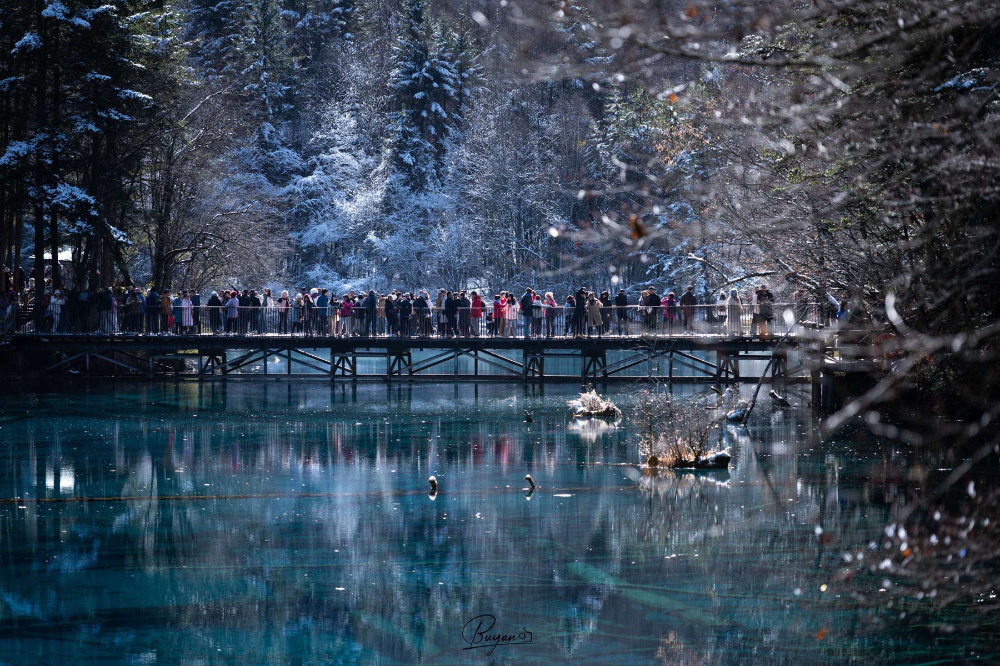
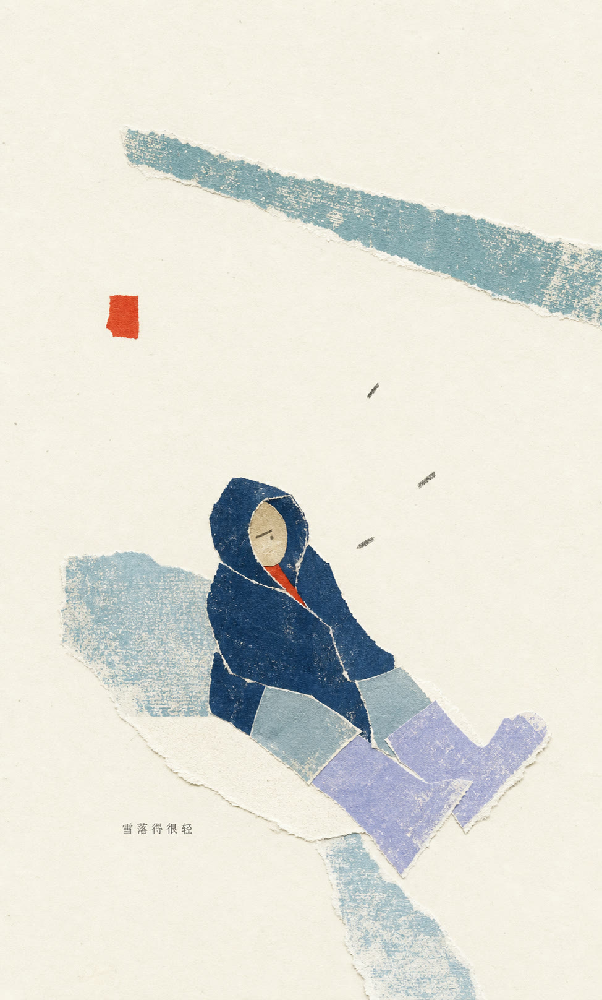

# 作品档案 · Scene Archive

**作者 / Author：Zeejay0**

这里保存拾景纸刊的精选案例。每个案例不是单独的一张结果图，而是一份“原始照片 → 观察记录 → 最终作品”的场景档案。

## 实景拼贴 · Gathered Scenes

### 01 · 石与天空相遇 / Where Stone Meets Sky

| 原始照片 | 最终作品 |
| :---: | :---: |
|  |  |

[打开场景档案](real-scene-collage/01-where-stone-meets-sky/)

### 02 · 冬日渡桥 / Winter Crossing

| 原始照片 | 最终作品 |
| :---: | :---: |
|  |  |

[打开场景档案](real-scene-collage/02-winter-crossing/)

## 影像蒸馏 · Scene Distillation

### 01 · 时间挥手回应 / Time Waves Back

| 原始照片 | 最终作品 |
| :---: | :---: |
|  |  |

[打开场景档案](image-distillation/01-time-waves-back/)

### 02 · 雪落得很轻 / Snow Falls Lightly

| 原始照片 | 最终作品 |
| :---: | :---: |
|  |  |

[打开场景档案](image-distillation/02-snow-falls-lightly/)
